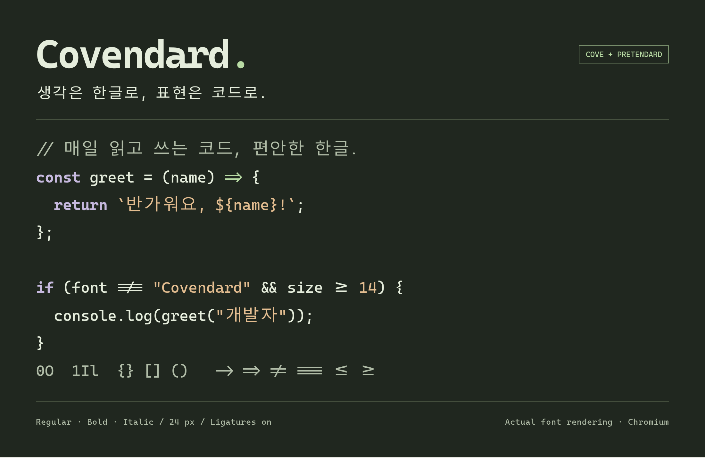
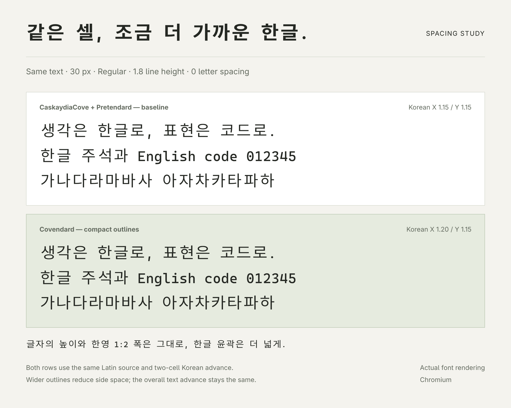

# Covendard

[English](README.en.md) · [웹사이트](https://jaekook.dev/covendard/) · [조사 기록](docs/README.md)

CaskaydiaCove Nerd Font Mono의 영문과 Pretendard의 한글을 결합한 코딩 폰트입니다.
Jetendard에서 제작하고 실사용한 Compact 설정을 독립 패밀리 **Covendard**로 옮겼습니다.
기본 한글 배율은 **가로 1.20·세로 1.15**입니다. 한영 1:2 폭, 프로그래밍 리거처,
Nerd Font 아이콘을 유지합니다. 이탤릭에서도 한글은 정자체입니다.



## 만든 이유

터미널에서 한글을 읽다 보면 글자 사이가 유난히 넓게 느껴질 때가 있습니다.
웹이나 일반 앱에서는 자연스럽던 문장도 고정폭 글꼴 안에서는 듬성듬성해 보였습니다.
영문 코드와 한글 주석을 함께 읽을 때 이 간격이 눈에 걸렸고, 매일 사용하는 화면에서
한글을 조금 더 편안하게 읽고 싶었습니다.

Covendard는 그 불편을 줄이기 위해 시작했습니다. 터미널의 한영 1:2 정렬을 유지하면서
한글의 가로 윤곽을 넓혀, 고정된 칸 안의 여백을 줄였습니다. 글자의 높이와 문장이
차지하는 폭은 그대로 두고 한글이 더 촘촘하게 보이도록 조정한 것입니다.
여기에 마음에 들었던 CaskaydiaCove의 영문과 리거처를 결합하고, 직접 사용하며
만족한 설정을 하나의 폰트로 정리했습니다.

## 한글 자간 비교



두 행 모두 Regular 30px, 같은 행간, 추가 자간 0으로 표시했습니다.
Covendard는 글자의 높이와 두 칸 이동 폭을 유지하면서 한글 윤곽을 넓힙니다.
실제 폰트를 Chromium으로 렌더링한 이미지이며 에디터·터미널 캡처는 아닙니다.
[렌더링 조건과 재현 방법](assets/specimens/README.md).

## 설치

웹사이트의 `Covendard.zip`을 풀고 `ttf/`의 네 파일을 설치한 뒤 **Covendard**를 선택하세요.
Regular·Italic·Bold·BoldItalic과 WOFF2를 포함합니다. OTF도 로컬 빌드에서 생성합니다.
데스크톱에서는 TTF 또는 OTF 중 한 형식만 설치하세요. OTF는 CFF 변환물이 아닌
TrueType 윤곽을 유지한 출력입니다.

## 빌드와 검증

Python 3.12와 uv를 사용하며 의존성 버전은 `uv.lock`에 고정되어 있습니다.

```sh
uv sync --locked --all-groups
make download
make run
make lint test
make build
uv run python scripts/package_release.py
```

`make run`은 배포용 네 스타일을, `make run-all` 또는 `uv run covendard --all`은
ExtraLight·Light·Regular·SemiBold·Bold의 정자체와 이탤릭 총 열 스타일을 만듭니다.
SemiLight는 같은 이름의 Pretendard 정적 원본이 없어 제외합니다.

```sh
uv run covendard --variants Regular Italic Bold BoldItalic
uv run covendard --variants Regular --korean-scale-x 1.20 --korean-scale-y 1.15
uv run covendard --help
```

배율 옵션을 생략하면 가로 1.20·세로 1.15를 독립 적용합니다.
`--korean-scale 1.15`만 명시하면 기존 균등 배율 방식입니다. 축 옵션을 하나라도
지정하면 독립 조정하며, 생략한 축은 `--korean-scale` 값(생략 시 1.15)을 사용합니다.
윤곽을 넓혀 여백을 줄이며 한글 두 칸 폭과 문장 전체 이동 폭은 유지합니다.

`--latin-family jetbrainsmono`는 별도 **Covendard JB** 패밀리로 지원합니다.
원본은 Nerd Fonts v3.4.0, Pretendard 1.3.9입니다. 생성 폰트·ZIP·원본은 Git에서 제외합니다.
배포 스크립트는 `dist/Covendard.zip`과 SHA-256을 만들며,
`--site-dir ../cloudflare-pages/public/covendard`로 사이트 다운로드·웹폰트도 갱신합니다.

## 출처

[Jetendard](https://github.com/jaekook/jetendard)에서 파생되었으며, 기존 프로젝트가 참고한
[Yeomil Mono](https://github.com/taevel02/yeomil-mono)의 기여를 유지합니다.
영문은 Cascadia Code의 Nerd Fonts 버전, 한글/CJK는 Pretendard입니다.
[LICENSE](LICENSE)와 `licenses/`의 저작권·OFL 고지를 함께 배포합니다.
기존 조사 문서의 Jetendard 이름은 당시 작업을 가리키므로 보존했습니다.
